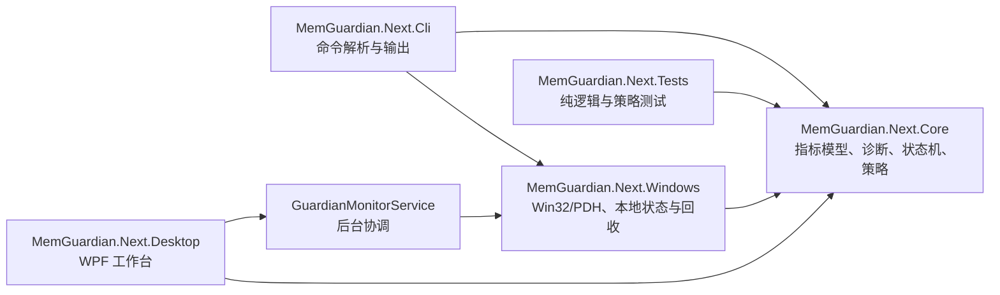
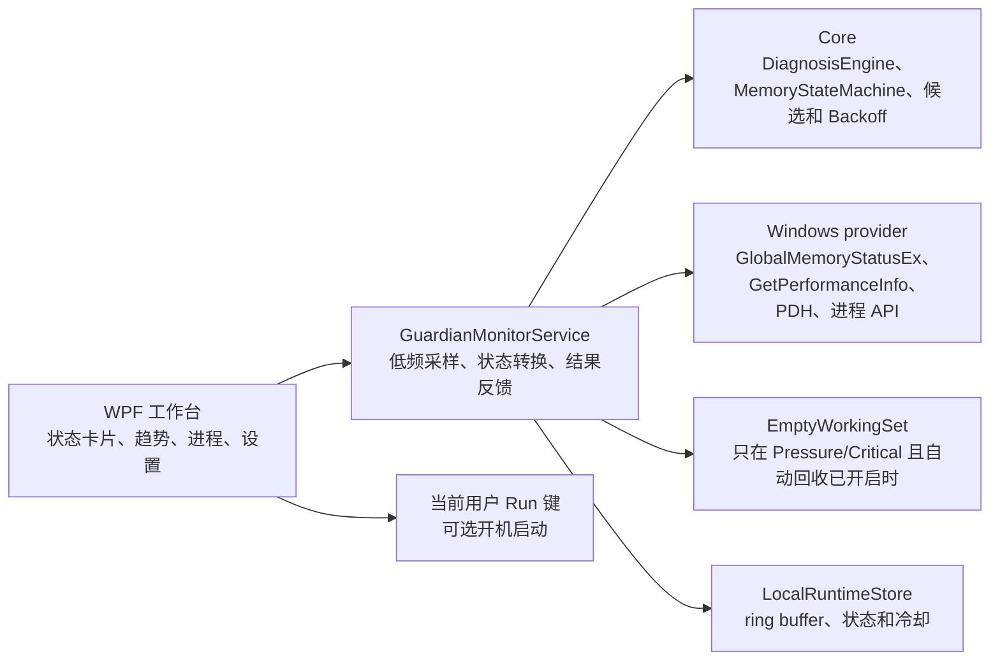

# MemGuardian.Next：Windows 内存压力诊断与自适应回收

## 1. 背景与目标

从空工作区创建 Windows 10/11 x64、.NET 8 内存诊断工具，现包含可视化 WPF 工作台和 CLI。目标是区分物理驻留压力、系统 Commit 压力、实际分页活动和内核池增长；只在持续 Pressure/Critical 且有可靠闲置证据时，按上限回收进程 Working Set，并用回收后的可用 RAM、Commit 和 paging 结果调整策略。

成功不以“进程 Working Set 下降”单独判定。系统必须报告可用 RAM 与 Commit 的变化；若只有 resident pages 下降，明确说明没有证据表明 Commit 被释放。

## 2. 需求与约束

- 目标框架为 .NET 8，Windows 10/11 x64；提供 WPF 桌面端和 CLI，CLI 支持 `status`、两种 `top`、`diagnose`、`run`（含 `--dry-run`）和 `once`。
- 采集优先使用 `GlobalMemoryStatusEx`、`GetPerformanceInfo`、`PdhAddEnglishCounterW`、`GetProcessMemoryInfo`。进程 CPU/I/O 使用 documented process counters 的时间差；进程列表由 `Process.GetProcesses()` 获取，不用高频 WMI。
- 首轮策略默认参数：状态采样和前台使用轮询 5 秒、进程采样 15 秒、趋势最长 60 分钟、最多 720 个系统样本；每个进程样本最多保存 512 个 Private Commit 观测；进入压力状态需持续时间确认并带退出迟滞。
- 回收候选必须属于当前用户和当前 Session，后台且 Working Set 不低于 256 MiB，CPU 不高于 1%，I/O 不高于 64 KiB/s，并且最近前台使用时间已知且超过 10 分钟。最近 120 秒使用、前台进程、自身、denylist、身份或使用历史未知的进程不可回收。
- 每轮最多 2 个进程；回收使用 documented `EmptyWorkingSet`；默认全局 cooldown 5 分钟、同一进程 15 分钟。失败或 paging 恶化时持久化较长 Backoff。
- 本地状态和趋势写入 `%LOCALAPPDATA%\MemGuardian.Next`，有界并原子替换；不联网、不遥测。并发运行时用独占锁阻止双重回收。

以上阈值是保守的首版默认值，不是跨设备已验证的最佳值。状态判断组合可用 RAM、Commit、paging 和 pool 趋势，避免按单一内存百分比动作。

## 3. API 语义与证据

- `GetPerformanceInfo` 返回 CommitTotal/Limit、物理总量/可用量、系统缓存、paged/nonpaged kernel pool，计量单位是页；`PageSize` 用于换算字节。`PhysicalAvailable` 包含 standby、free、zero lists。[Microsoft: PERFORMANCE_INFORMATION](https://learn.microsoft.com/en-us/windows/win32/api/psapi/ns-psapi-performance_information)
- `GlobalMemoryStatusEx` 返回当前物理与虚拟内存使用信息；结果是易变快照。[Microsoft: GlobalMemoryStatusEx](https://learn.microsoft.com/en-us/windows/win32/api/sysinfoapi/nf-sysinfoapi-globalmemorystatusex)
- `MEMORYSTATUSEX.ullTotalPageFile/ullAvailPageFile` 实际表示当前进程的 commit allowance，不等于 pagefile 文件容量；首版不把它当作 pagefile 大小，单独通过 PDH 显示 pagefile usage。[Microsoft: MEMORYSTATUSEX](https://learn.microsoft.com/en-us/windows/win32/api/sysinfoapi/ns-sysinfoapi-memorystatusex)
- `GetProcessMemoryInfo` 通过 `PROCESS_MEMORY_COUNTERS_EX` 取得进程 Working Set 与 PrivateUsage；文档将 Working Set 定义为当前映射到进程上下文的物理内存。[Microsoft: GetProcessMemoryInfo](https://learn.microsoft.com/en-us/windows/win32/api/psapi/nf-psapi-getprocessmemoryinfo)
- PDH 用 `PdhAddEnglishCounterW` 添加语言无关的页面读取、Pages Input 与 pagefile usage counters；单个 counter 不可用时保留其余诊断并标记缺失。[Microsoft: PdhAddEnglishCounterW](https://learn.microsoft.com/en-us/windows/win32/api/pdh/nf-pdh-pdhaddenglishcounterw)
- `EmptyWorkingSet` 的契约是尽可能移除目标进程的 Working Set 页面；它不保证释放 Private Commit。[Microsoft: EmptyWorkingSet](https://learn.microsoft.com/en-us/windows/win32/api/psapi/nf-psapi-emptyworkingset)
- Microsoft 将 Page Reads/sec 和 Pages Input/sec 分别作为读取操作数与读取页面数，二者不能互换。[Microsoft: memory paging counters](https://learn.microsoft.com/en-us/biztalk/technical-guides/system-level-bottlenecks)

## 4. 架构与方案取舍

采用三层项目：

核心诊断与选择逻辑不调用 Win32，测试用可控样本和 fake reclaimer。Win32 provider 集中封装 `SafeHandle` 和错误边界，CLI 负责组合只读采样与可选回收。

方案对比：

| 选择 | 优点 | 代价 | 本项目决定 |
|---|---|---|---|
| 小型手写 CLI 解析 | 零运行时包；命令数量固定，可逐项测试 | help、校验和错误提示需项目维护 | 采用；命令树很小且无需 shell completion |
| `System.CommandLine` | 官方命令树、选项绑定与帮助能力；仓库持续发布 2.x | 新增包和 API 熟悉成本；当前命令规模收益有限 | 暂不采用；若命令扩张或需 completion 再评估 |
| xUnit v2 / MSTest / NUnit | 均有成熟 .NET runner 与测试发现 | 都需测试 SDK/adapter；框架主版本带迁移面 | 选 xUnit v2 标准 VSTest 组合，避开近期 v4 的迁移面 |
| WPF / WinUI 3 | WPF 可直接使用 .NET 8 和 ControlTemplate 自定义外观；WinUI 3 提供 Windows App SDK 现代控件 | WinUI 3 增加 Windows App SDK 与打包/运行时约束；WPF 自带 Windows-only 定位 | 选择 WPF，使用自定义模板、矢量图表和卡片布局，不使用默认 DataGrid / 原生默认按钮样式 |

官方仓库显示 xUnit 持续发布 v3/v4，MSTest 与 NUnit 也持续维护，因此选择不是基于“唯一可用”，而是保留成熟 VSTest 工作流并将依赖限制在测试项目。[xUnit releases](https://github.com/xunit/xunit/releases) [MSTest/TestFX](https://github.com/microsoft/testfx) [NUnit](https://github.com/nunit/nunit)

`System.CommandLine` 当前已有稳定 2.x，但固定六个命令用手写解析的依赖成本更低；若未来需要复杂子命令、completion 或生成帮助，应重新评估官方库。[System.CommandLine docs](https://learn.microsoft.com/en-us/dotnet/standard/commandline/) [releases](https://github.com/dotnet/command-line-api/releases)

运行时项目只使用 .NET 自带库，不加入第三方依赖；xUnit 仅作为测试项目的开发依赖。对照官方文档和仓库后，没有证据表明当前 CLI 需要框架或 Windows Service 宿主。项目为空，没有现存依赖和架构可复用。

趋势使用固定容量 ring buffer：系统样本最多 720 条（5 秒采样、覆盖 60 分钟）；每条最多保存 512 个按 Private Commit 排序的进程观测，PID 与创建时间共同标识进程实例。诊断窗口不足时不推断泄漏。

## 5. 状态与诊断规则

诊断标记与控制状态分开表示。诊断可以同时显示 WorkingSetPressure、CommitPressure、PagingPressure、KernelPoolPressure、PossibleProcessLeak、PossibleDriverLeak；控制器状态为 Normal、Watch、Pressure、Critical、Cooldown、Backoff。

首版 raw severity 从组合信号计算：可用 RAM 严重偏低，Commit 接近 limit，或低 RAM 下持续页面读取可进入 Pressure/Critical；中度低可用量、较高 Commit、持续 paging 或较高 kernel pool 进入 Watch。进入状态要求连续时间，退出使用更宽松的恢复阈值和更长确认时间。阈值集中在 Options 并可通过 JSON 修改。

`PossibleProcessLeak` 要求同一 PID + process creation time 在至少 10 分钟窗口内 Private Commit 净增至少 256 MiB 且大部分采样持续上升。`PossibleDriverLeak` 对 Nonpaged Pool 使用至少 10 分钟、至少 64 MiB 净增的同类趋势判断。它们只提示可疑，不宣称根因已定位。

## 6. 回收与反馈

Phase 1 边界：完成采集、status/top/diagnose、状态机与完整 dry-run；dry-run 调用同一个候选选择器，但没有回收器调用权限。

Phase 2：仅在 Pressure/Critical、冷却已结束且候选满足全部限制时执行。重新打开进程句柄后复核 creation time、用户和 Session，再调用 `EmptyWorkingSet`。单轮最多两个；Access Denied、退出和 native error 单独记录。

回收前后记录可用 RAM、系统/候选 Working Set、Commit、Page Reads/sec 和 Pages Input/sec。数秒后重采。可用 RAM 提升不足、分页率相对回收前显著上升、或无法验证目标存活时降低策略评分并增加 cooldown/backoff。若 Working Set 明显下降而 Private Commit 基本不变，输出“驻留页已回收，Commit 未明显释放”。

策略反馈是设备上的初始规则，不保证卡顿改善；实际效果需在目标设备按同一工作负载重复记录回收前后可用 RAM、paging、目标应用响应时间，并与不回收基线比较。当前开发容器没有可代表用户负载的卡顿测量基线。

## 7. 风险与影响范围

- Working Set trim 可能在应用再次访问页面时造成硬缺页；分页变差时必须及时 Backoff。
- 系统前台历史在连续 `run` 中观察并保存；若程序没有足够历史，候选按不安全处理而跳过，单次 `once` 可能没有候选。
- PDH 性能计数器可能损坏、禁用或不可用；此时显示 paging unavailable，禁止基于缺失 counter 判定 trim 成功。
- PID 可复用；cooldown 与泄漏趋势必须包含创建时间。
- 回收前后使用 `IsProcessCritical` 再校验 Windows critical-process 标记；状态未知时按不可回收处理。
- 用户可编辑本地设置，但加载时会保留安全下限：120 秒最近使用保护、10 分钟空闲/趋势窗口、持续压力确认、64 MiB 可用 RAM 成功阈值、策略最低分、5/15 分钟冷却及每轮最多两个目标。
- Access Denied 是正常可恢复结果；不得通过提升权限或启用调试权限绕过。
- 项目从空目录创建，因此当前不存在既有 API/数据格式兼容义务。

## 8. 验收与测试计划

自动化测试覆盖：正常内存、高物理压力低 Commit、高 Commit、前台保护、冷却、dry-run 绝不回收、进程 Private Commit 泄漏、Nonpaged Pool 趋势、回收后 paging 恶化进入 Backoff、阈值迟滞及 ring buffer 有界。

用户指定的 `dotnet build -c Release` 和 `dotnet test -c Release` 必须执行。Windows API smoke 只读取系统和当前进程样本；CLI `--help` 启动检查不写用户数据。`status`/`diagnose` 会写入 LocalAppData 趋势状态，因此本轮未调用这些命令；未触发真实进程回收。性能结论只报告实际设备测量，不以源码逻辑或 dry-run 代替真实卡顿验证。

## 9. 实施进度

- 已确认工作区为空且不存在既有 `doc/`；当前建立本文。
- 初始版本已实现 Core / Windows / CLI / Tests 四项目；桌面端扩展为五项目。首轮编译前复核修正了 `OpenProcessToken` 的 advapi32 导入，并新增 native trim 前的新鲜快照与前台状态复核。`once` / `diagnose` 也会记录轮询到的前台进程，以建立最近使用保护。
- 临时安装 .NET SDK 8.0.425 后，桌面端迭代的最终 Release build 通过（0 警告、0 错误）；最终 Release 测试 25/25 通过，包含只读 Windows API smoke test、旧状态兼容和回收反馈持久化测试，不调用任何真实回收 API。
- `dotnet publish src\MemGuardian.Next.Cli -c Release -r win-x64 --self-contained false` 成功生成 `memguardian.exe`；直接启动 `memguardian.exe --help` 输出预期命令帮助。未调用会持久化本地趋势状态的 status/diagnose，也未运行会真实回收的 `once` 或 `run`。
- 尚未在真实目标负载下测量卡顿、响应时间或回收效果；这部分需在 Windows 10/11 代表性工作负载上按性能验证方案执行。

## 10. 可视化桌面端与常驻运行

### 10.1 模块边界

在核心诊断和 Windows provider 上新增 `MemGuardian.Next.Desktop`。WPF 界面只负责呈现指标、接收设置和控制后台服务；诊断、状态转换、候选筛选和回收反馈仍调用 Core 中既有实现。这样 GUI 不维护第二套诊断阈值或回收规则。

桌面端使用 `WindowChrome` 自绘标题栏，应用级样式重定义按钮、文本输入框与开关模板；进程榜单由自定义 `ItemsControl` 行构成，不使用默认 `DataGrid`；趋势图是自绘 WPF `FrameworkElement`，不增加第三方图表依赖。仪表盘显示物理 Available、系统 Commit、paging、内核池/pagefile；进程页显示 PID、进程名、用户与 Session、前台/最近使用、CPU、I/O、Working Set、Private Commit、线程和句柄。

### 10.2 配置与托盘

- 桌面开关写入 `%LOCALAPPDATA%\MemGuardian.Next\desktop.json`，诊断参数仍与 CLI 共用 `settings.json` 和 `LocalRuntimeStore`。编辑后先经 `NormalizeOptions` 校验，再替换有界 ring buffer 并持久化。
- 自动监控默认开启，自动回收默认关闭。关闭窗口仅在用户启用“后台运行”时转入托盘；托盘双击恢复，窗口“退出应用”会停止采样、保存状态并释放互斥锁。
- 一键开机启动只操作当前用户 `HKCU\Software\Microsoft\Windows\CurrentVersion\Run\MemGuardian.Next` 项，不创建计划任务或服务，不申请管理员权限。启动命令含可执行文件绝对路径，用户可选登录后最小化到托盘。
- 桌面监控和会写状态的 CLI 命令共用独占锁；进程采样默认 15 秒，系统样本默认 5 秒，避免高频全量进程轮询。趋势 ring buffer 固定容量，页面只显示最近 15 分钟。
- 每次真实 trim 的回收前后 Available RAM、目标 Working Set、系统 Commit、Page Reads/sec、Pages Input/sec 和目标进程身份都会写入状态文件；只保留最近 32 条，旧版 state schema 1 可继续读取并在下一次保存时升级。

### 10.3 安全策略与未验证项

设置页开放 Available / Commit 压力阈值、采样频率、paging 告警、持续确认时间、空闲门槛、候选 Working Set / CPU / I/O 上限、冷却、反馈等待、泄漏增长阈值及 denylist。程序强制保留最近使用 120 秒、空闲时间至少 10 分钟、全局冷却至少 5 分钟、同进程冷却至少 15 分钟、候选 Working Set 至少 256 MiB、每轮最多两个进程等下限。

显式开启自动回收后，后台服务仅在状态机确认 Pressure / Critical 时，将候选送入既有 `AdaptiveReclaimCoordinator`。native 调用前继续复核目标身份与前台状态；回收后观察 Available RAM、Working Set、Commit 和 paging。paging 明显恶化会停止本轮并进入 Backoff。`EmptyWorkingSet` 的效果界定为驻留页回收，不保证降低 Commit。

已确认事实：Release 构建会编译 XAML 和自定义 WPF 控件；策略与配置由自动化测试覆盖。暂未验证：此运行环境没有目标用户的真实内存压力负载数据，也没有回收前后交互延迟/硬缺页测量；首次真实设备验证应先保持自动回收关闭、观察 dry-run 候选和 15 分钟趋势，再在可恢复的工作负载下小范围启用。

## 11. 桌面端实施与验证结果

- 新增 `MemGuardian.Next.Desktop` 并加入 solution；桌面状态/趋势/进程榜单/诊断证据与策略编辑共用 Core、Windows 采集和本地状态模型；CLI 仍保留给脚本使用。
- 以 `DesktopPreferencesStore` 持久化托盘和开机项相关 UI 开关；`WindowsStartupRegistration` 仅写当前用户 Run 键；测试只覆盖纯命令行构造和临时目录 JSON，不触碰真实用户注册表。
- `LocalRuntimeStore.UpdateOptions` 在强制边界校验后保留新窗口范围内的历史；自适应策略最小冷却与泄漏增长阈值另有单元测试。
- 最终验证结果：`dotnet build -c Release` 成功、0 warning / 0 error；`dotnet test -c Release` 成功、25 项通过。测试覆盖原核心策略、桌面设置/启动命令、回收前后测量和有界持久化；测试不调用真实 `EmptyWorkingSet`，也不修改用户注册表。
- 没有在开发机上启用自动回收、修改 Run 注册表项或宣称卡顿改善；目标设备 CPU、page reads、hard fault 和应用响应时间仍需按本节的负载对照方案测量。
- Git 本地分模块提交已按 `英文类型: 中文描述` 格式记录。GitHub 账号查询到的同名 `LunaOpenLabs/Luna-Cleaner` 仓库当前权限为只读；不会将内容推到无写权限的仓库。需要用户提供其有写权限的远端地址，或开通该目标仓库写权限后再上传。

## 12. 桌面界面可读性、交互反馈与最大化边界

### 背景与根因

用户截图显示，左侧菜单文字与深色侧栏对比不足，页面主体仍沿用浅色卡片，最大化时自绘窗口标题区域可能越过屏幕工作区。应用级 `TextBlock` 隐式样式直接设置正文色，使导航按钮的前景色未可靠传递给内部图标和文字；自绘 `WindowChrome` 未处理 `WM_GETMINMAXINFO`，因此系统没有按当前显示器工作区计算最大化位置和尺寸。刷新、设置保存和开机启动操作此前也缺少明确的进行中反馈。

### 修改

- 全局主题统一为暗色渐变背景、深色信息卡、青绿至蓝色强调渐变和较高对比度的正文/次级文字，菜单选中态增加强调色边线；菜单图标和文字显式跟随按钮前景色。
- 刷新、设置保存和开机启动操作期间禁用对应按钮并显示进行中状态；刷新增加 30 秒超时反馈，完成或停止监控时恢复按钮状态。
- 自绘窗口通过 `WM_GETMINMAXINFO` 使用当前显示器工作区作为最大化边界，并在最大化状态调整窗口边角及最大化/还原图标。
- 首轮单节点编译暴露 `System.Windows.Forms.Button` 与 WPF `Button` 的 `CS0104` 歧义；用 `WpfButton` 别名限定桌面控件字段、导航辅助函数和事件处理器类型。

### 验证与限制

- 普通 `dotnet build -c Release` 在解决方案 Restore 阶段失败，日志显示 `_FilterRestoreGraphProjectInputItems` 任务失败但没有 MSBuild 错误详情。使用 `-m:1` 继续后定位并修复上述两个 WPF 编译错误。
- 最终 `dotnet build -c Release -m:1 -v:minimal` 成功，0 警告、0 错误；`dotnet test -c Release -m:1 -v:minimal` 成功，25/25 通过。`git diff --check` 返回成功，只有 Git 的 LF/CRLF 行尾提示。
- 构建已编译 WPF XAML 和代码；尚未在真实桌面窗口中手动核验多显示器/DPI 最大化、导航视觉、刷新超时、保存及开机启动交互，也未测量真实负载下的卡顿和分页影响。
