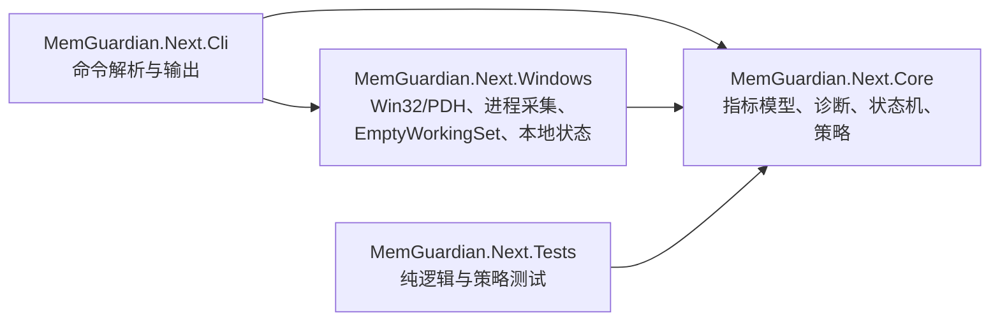

# MemGuardian.Next：Windows 内存压力诊断与自适应回收

## 1. 背景与目标

从空工作区创建 Windows 10/11 x64、.NET 8 CLI。目标是区分物理驻留压力、系统 Commit 压力、实际分页活动和内核池增长；只在持续 Pressure/Critical 且有可靠闲置证据时，按上限回收进程 Working Set，并用回收后的可用 RAM、Commit 和 paging 结果调整策略。

成功不以“进程 Working Set 下降”单独判定。系统必须报告可用 RAM 与 Commit 的变化；若只有 resident pages 下降，明确说明没有证据表明 Commit 被释放。

## 2. 需求与约束

- 目标框架为 .NET 8，Windows 10/11 x64；CLI 支持 `status`、两种 `top`、`diagnose`、`run`（含 `--dry-run`）和 `once`。
- 采集优先使用 `GlobalMemoryStatusEx`、`GetPerformanceInfo`、`PdhAddEnglishCounterW`、`GetProcessMemoryInfo`。进程 CPU/I/O 使用 documented process counters 的时间差；进程列表由 `Process.GetProcesses()` 获取，不用高频 WMI。
- 首轮策略默认参数：状态采样和前台使用轮询 5 秒、进程采样 15 秒、趋势最长 60 分钟、最多 720 个系统样本；每个进程样本最多保存 512 个 Private Commit 观测；进入压力状态需持续时间确认并带退出迟滞。
- 回收候选必须属于当前用户和当前 Session，后台且 Working Set 不低于 256 MiB，CPU 不高于 1%，I/O 不高于 64 KiB/s，并且最近前台使用时间已知且超过 10 分钟。最近 120 秒使用、前台进程、自身、denylist、身份或使用历史未知的进程不可回收。
- 每轮最多 2 个进程；回收使用 documented `EmptyWorkingSet`；默认全局 cooldown 5 分钟、同一进程 15 分钟。失败或 paging 恶化时持久化较长 Backoff。
- 本地状态和趋势写入 `%LOCALAPPDATA%\MemGuardian.Next`，有界并原子替换；不联网、不遥测。并发运行时用独占锁阻止双重回收。

以上阈值是保守的首版默认值，不是跨设备已验证的最佳值。状态判断组合可用 RAM、Commit、paging 和 pool 趋势，避免按单一内存百分比动作。

## 3. API 语义与证据

- `GetPerformanceInfo` 返回 CommitTotal/Limit、物理总量/可用量、系统缓存、paged/nonpaged kernel pool，计量单位是页；`PageSize` 用于换算字节。`PhysicalAvailable` 包含 standby、free、zero lists。[Microsoft: PERFORMANCE_INFORMATION](https://learn.microsoft.com/en-us/windows/win32/api/psapi/ns-psapi-performance_information)
- `GlobalMemoryStatusEx` 返回当前物理与虚拟内存使用信息；结果是易变快照。[Microsoft: GlobalMemoryStatusEx](https://learn.microsoft.com/en-us/windows/win32/api/sysinfoapi/nf-sysinfoapi-globalmemorystatusex)
- `MEMORYSTATUSEX.ullTotalPageFile/ullAvailPageFile` 实际表示当前进程的 commit allowance，不等于 pagefile 文件容量；首版不把它当作 pagefile 大小，单独通过 PDH 显示 pagefile usage。[Microsoft: MEMORYSTATUSEX](https://learn.microsoft.com/en-us/windows/win32/api/sysinfoapi/ns-sysinfoapi-memorystatusex)
- `GetProcessMemoryInfo` 通过 `PROCESS_MEMORY_COUNTERS_EX` 取得进程 Working Set 与 PrivateUsage；文档将 Working Set 定义为当前映射到进程上下文的物理内存。[Microsoft: GetProcessMemoryInfo](https://learn.microsoft.com/en-us/windows/win32/api/psapi/nf-psapi-getprocessmemoryinfo)
- PDH 用 `PdhAddEnglishCounterW` 添加语言无关的页面读取、Pages Input 与 pagefile usage counters；单个 counter 不可用时保留其余诊断并标记缺失。[Microsoft: PdhAddEnglishCounterW](https://learn.microsoft.com/en-us/windows/win32/api/pdh/nf-pdh-pdhaddenglishcounterw)
- `EmptyWorkingSet` 的契约是尽可能移除目标进程的 Working Set 页面；它不保证释放 Private Commit。[Microsoft: EmptyWorkingSet](https://learn.microsoft.com/en-us/windows/win32/api/psapi/nf-psapi-emptyworkingset)
- Microsoft 将 Page Reads/sec 和 Pages Input/sec 分别作为读取操作数与读取页面数，二者不能互换。[Microsoft: memory paging counters](https://learn.microsoft.com/en-us/biztalk/technical-guides/system-level-bottlenecks)

## 4. 架构与方案取舍

采用三层项目：

核心诊断与选择逻辑不调用 Win32，测试用可控样本和 fake reclaimer。Win32 provider 集中封装 `SafeHandle` 和错误边界，CLI 负责组合只读采样与可选回收。

方案对比：

| 选择 | 优点 | 代价 | 本项目决定 |
|---|---|---|---|
| 小型手写 CLI 解析 | 零运行时包；命令数量固定，可逐项测试 | help、校验和错误提示需项目维护 | 采用；命令树很小且无需 shell completion |
| `System.CommandLine` | 官方命令树、选项绑定与帮助能力；仓库持续发布 2.x | 新增包和 API 熟悉成本；当前命令规模收益有限 | 暂不采用；若命令扩张或需 completion 再评估 |
| xUnit v2 / MSTest / NUnit | 均有成熟 .NET runner 与测试发现 | 都需测试 SDK/adapter；框架主版本带迁移面 | 选 xUnit v2 标准 VSTest 组合，避开近期 v4 的迁移面 |

官方仓库显示 xUnit 持续发布 v3/v4，MSTest 与 NUnit 也持续维护，因此选择不是基于“唯一可用”，而是保留成熟 VSTest 工作流并将依赖限制在测试项目。[xUnit releases](https://github.com/xunit/xunit/releases) [MSTest/TestFX](https://github.com/microsoft/testfx) [NUnit](https://github.com/nunit/nunit)

`System.CommandLine` 当前已有稳定 2.x，但固定六个命令用手写解析的依赖成本更低；若未来需要复杂子命令、completion 或生成帮助，应重新评估官方库。[System.CommandLine docs](https://learn.microsoft.com/en-us/dotnet/standard/commandline/) [releases](https://github.com/dotnet/command-line-api/releases)

运行时项目只使用 .NET 自带库，不加入第三方依赖；xUnit 仅作为测试项目的开发依赖。对照官方文档和仓库后，没有证据表明当前 CLI 需要框架或 Windows Service 宿主。项目为空，没有现存依赖和架构可复用。

趋势使用固定容量 ring buffer：系统样本最多 720 条（5 秒采样、覆盖 60 分钟）；每条最多保存 512 个按 Private Commit 排序的进程观测，PID 与创建时间共同标识进程实例。诊断窗口不足时不推断泄漏。

## 5. 状态与诊断规则

诊断标记与控制状态分开表示。诊断可以同时显示 WorkingSetPressure、CommitPressure、PagingPressure、KernelPoolPressure、PossibleProcessLeak、PossibleDriverLeak；控制器状态为 Normal、Watch、Pressure、Critical、Cooldown、Backoff。

首版 raw severity 从组合信号计算：可用 RAM 严重偏低，Commit 接近 limit，或低 RAM 下持续页面读取可进入 Pressure/Critical；中度低可用量、较高 Commit、持续 paging 或较高 kernel pool 进入 Watch。进入状态要求连续时间，退出使用更宽松的恢复阈值和更长确认时间。阈值集中在 Options 并可通过 JSON 修改。

`PossibleProcessLeak` 要求同一 PID + process creation time 在至少 10 分钟窗口内 Private Commit 净增至少 256 MiB 且大部分采样持续上升。`PossibleDriverLeak` 对 Nonpaged Pool 使用至少 10 分钟、至少 64 MiB 净增的同类趋势判断。它们只提示可疑，不宣称根因已定位。

## 6. 回收与反馈

Phase 1 边界：完成采集、status/top/diagnose、状态机与完整 dry-run；dry-run 调用同一个候选选择器，但没有回收器调用权限。

Phase 2：仅在 Pressure/Critical、冷却已结束且候选满足全部限制时执行。重新打开进程句柄后复核 creation time、用户和 Session，再调用 `EmptyWorkingSet`。单轮最多两个；Access Denied、退出和 native error 单独记录。

回收前后记录可用 RAM、系统/候选 Working Set、Commit、Page Reads/sec 和 Pages Input/sec。数秒后重采。可用 RAM 提升不足、分页率相对回收前显著上升、或无法验证目标存活时降低策略评分并增加 cooldown/backoff。若 Working Set 明显下降而 Private Commit 基本不变，输出“驻留页已回收，Commit 未明显释放”。

策略反馈是设备上的初始规则，不保证卡顿改善；实际效果需在目标设备按同一工作负载重复记录回收前后可用 RAM、paging、目标应用响应时间，并与不回收基线比较。当前开发容器没有可代表用户负载的卡顿测量基线。

## 7. 风险与影响范围

- Working Set trim 可能在应用再次访问页面时造成硬缺页；分页变差时必须及时 Backoff。
- 系统前台历史在连续 `run` 中观察并保存；若程序没有足够历史，候选按不安全处理而跳过，单次 `once` 可能没有候选。
- PDH 性能计数器可能损坏、禁用或不可用；此时显示 paging unavailable，禁止基于缺失 counter 判定 trim 成功。
- PID 可复用；cooldown 与泄漏趋势必须包含创建时间。
- 回收前后使用 `IsProcessCritical` 再校验 Windows critical-process 标记；状态未知时按不可回收处理。
- 用户可编辑本地设置，但加载时会保留安全下限：120 秒最近使用保护、10 分钟空闲/趋势窗口、持续压力确认、64 MiB 可用 RAM 成功阈值、策略最低分、5/15 分钟冷却及每轮最多两个目标。
- Access Denied 是正常可恢复结果；不得通过提升权限或启用调试权限绕过。
- 项目从空目录创建，因此当前不存在既有 API/数据格式兼容义务。

## 8. 验收与测试计划

自动化测试覆盖：正常内存、高物理压力低 Commit、高 Commit、前台保护、冷却、dry-run 绝不回收、进程 Private Commit 泄漏、Nonpaged Pool 趋势、回收后 paging 恶化进入 Backoff、阈值迟滞及 ring buffer 有界。

用户指定的 `dotnet build -c Release` 和 `dotnet test -c Release` 必须执行。Windows API smoke 只读取系统和当前进程样本；CLI `--help` 启动检查不写用户数据。`status`/`diagnose` 会写入 LocalAppData 趋势状态，因此本轮未调用这些命令；未触发真实进程回收。性能结论只报告实际设备测量，不以源码逻辑或 dry-run 代替真实卡顿验证。

## 9. 实施进度

- 已确认工作区为空且不存在既有 `doc/`；当前建立本文。
- 已实现 Core / Windows / CLI / Tests 四项目；首轮编译前复核修正了 `OpenProcessToken` 的 advapi32 导入，并新增 native trim 前的新鲜快照与前台状态复核。`once` / `diagnose` 也会记录轮询到的前台进程，以建立最近使用保护。
- 临时安装 .NET SDK 8.0.425 后，Release build 通过（0 警告、0 错误）；Release 测试 19/19 通过，包含只读 Windows API smoke test，验证系统和当前进程计数器，不调用任何回收 API。
- `dotnet publish src\MemGuardian.Next.Cli -c Release -r win-x64 --self-contained false` 成功生成 `memguardian.exe`；直接启动 `memguardian.exe --help` 输出预期命令帮助。未调用会持久化本地趋势状态的 status/diagnose，也未运行会真实回收的 `once` 或 `run`。
- 尚未在真实目标负载下测量卡顿、响应时间或回收效果；这部分需在 Windows 10/11 代表性工作负载上按性能验证方案执行。
